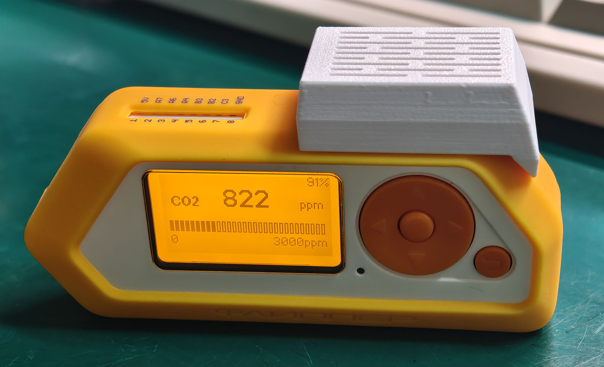
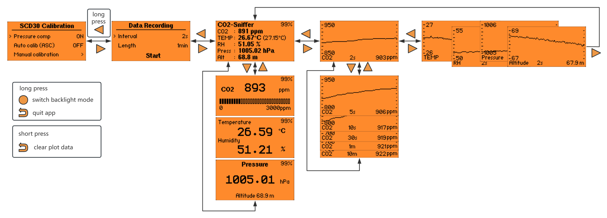
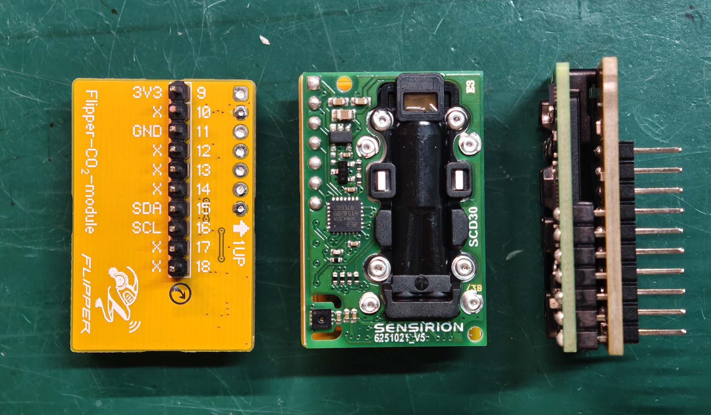
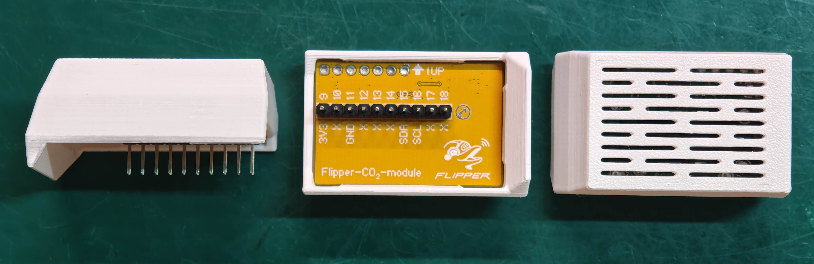

[简体中文](README-zh.md)

# CO2 Sniffer

CO2 Sniffer is a BMP388 + SCD30 environmental monitor for the Flipper Zero. Plug
the board into the GPIO header and open the app to view CO2, temperature,
humidity, pressure and estimated altitude. Readings can also be saved to the
microSD card or sent to a computer over USB.
The software project in `SW/` was developed by OpenAI Codex.

## Main features

- Measures CO2, temperature, humidity and pressure, and estimates altitude from
  the pressure reading.
- Offers several live dashboard layouts and history graphs for all five values.
- Saves readings to CSV at a chosen interval and duration, or sends them to a
  computer over USB.
- Continues with the remaining sensor if one becomes unavailable and reconnects
  it automatically when possible.

To keep startup transients out of the trend, history graphs omit the first 10
seconds after the app starts or the SCD30 reconnects.

## Controls

Button functions change with the current screen. All actions below are short
presses unless marked as a hold.

| Current screen | Input | Function |
| -------------- | ----- | -------- |
| Dashboard | **LEFT** | Open **Data Recording** |
| Dashboard | **RIGHT** | Open the first history graph |
| History graph | **LEFT / RIGHT** | Show the previous / next graph; return to the dashboard at either end |
| Dashboard | **UP / DOWN** | Change the dashboard layout |
| History graph | **UP / DOWN** | Change the graph time scale |
| Dashboard / history graph | **BACK** | Open the clear-history prompt; press **OK** to clear or **BACK** to cancel |
| Data Recording | **UP / DOWN** | Select the interval, length or **Start** field |
| Data Recording | **OK** | Change the selected setting; start when **Start** is selected, or stop while recording |
| Changing a recording setting | **LEFT / RIGHT** | Choose the required value |
| Changing a recording setting / Data Recording | **BACK** | Finish the current change; when not changing a setting, return to the dashboard |
| SCD30 settings | **UP / DOWN**, **OK** | Choose a setting and change it, or open manual calibration |
| Manual-calibration input | **LEFT / RIGHT**, **UP / DOWN** | Select and adjust a digit; press **OK** to review the value |

The following functions require a button hold:

| Where | Input | Function |
| ----- | ----- | -------- |
| Data Recording, while not changing a setting | Hold **LEFT** for 2 seconds | Open SCD30 settings |
| While reviewing a manual-calibration value | Hold **OK** for 2 seconds | Start calibration after the progress bar completes |
| When no calibration or exit prompt is shown | Hold **OK** | Turn the always-on backlight on or off |
| Any page | Hold **BACK** | Open the exit prompt; press **OK** to exit or **BACK** to cancel |

## Data recording

Data recording is useful for tracking environmental changes over time. Press
**LEFT** from the dashboard to open **Data Recording**, choose the interval and
recording length, then select **Start**. Recording ends automatically at the
chosen time. For a continuous recording, or to stop early, press **OK**.

| Setting | Choices |
| ------- | ------- |
| Interval | 2 s, 5 s, 10 s, 30 s, 1 min |
| Length | 1 min, 5 min, 10 min, 30 min, 1 h, 2 h, 8 h, 24 h, continuous |

Files are saved in `/ext/co2_sniffer/` on the microSD card. Each filename
includes the start time, interval and recording length. Every row contains the
time, elapsed recording time and available sensor readings; values from a
temporarily unavailable sensor are left empty. A blinking `REC` badge means
recording is active. If `SD!` appears, check that the microSD card is available
and writable.

## SCD30 settings and calibration

From **Data Recording**, hold **LEFT** for 2 seconds to open **SCD30
Calibration**. It provides two everyday settings:

- **Pressure comp** uses the current pressure measured by the BMP388 to improve
  SCD30 measurement accuracy.
- **Auto calib (ASC)** lets the SCD30 adjust its baseline during long-term use.

Pressure compensation is on and ASC is off by default. The app remembers later
changes and uses them again at the next startup.

### Manual calibration

Manual calibration is recommended only when the reading has a clear offset and
a reliable CO2 reference concentration is available. Do not treat outdoor air
as an exact 400 ppm reference.

Before calibration, leave the sensor running in a stable reference environment
for at least two minutes and keep faces away from it. Select **Manual
calibration**, enter the actual reference concentration (`0400–2000 ppm`), and
press **OK** to review it. Hold **OK** for 2 seconds; calibration starts only
after the progress bar completes, using the value entered as its reference.

## Hardware

The board connects to the Flipper GPIO port through a 2.54 mm 1×10 pin header
and carries the following sensors:

| Device | Role | I2C address |
| ------ | ---- | ----------- |
| Sensirion SCD30 | CO2, temperature, humidity | 0x61 |
| Bosch BMP388 | temperature, pressure | 0x76 |

I2C runs on GPIO C0 (SCL) / C1 (SDA), and the board is powered from the
Flipper's 3V3/5V pins. KiCad schematic and PCB design sources are in `HW/`.

## Fault handling

If one sensor is temporarily disconnected, its readings are shown as
unavailable while the other sensor continues to work. The app attempts to
restore the connection automatically. If the screen reports that the I2C bus
cannot be recovered, exit the app and restart the Flipper as instructed.

## Layout

- `HW/` — KiCad schematic and PCB design sources.
- `SW/` — Flipper app sources.
- `3d/` — Printable enclosure files: a 3MF with Bambu Lab settings and the original STEP model.
- `PROTOCOL.md` — full USB CDC serial protocol documentation.
- `README-zh.md` — this document in Chinese.

## License

GPL-3.0, see [LICENSE](LICENSE).

## USB data output

To receive live readings on a computer, connect the Flipper over USB and select
the second virtual COM port detected by the system. The first port is reserved
for the Flipper CLI. Measurements use a binary frame format; see
**[PROTOCOL.md](PROTOCOL.md)** for the complete frame format and parsing details.
